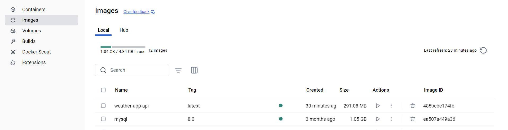
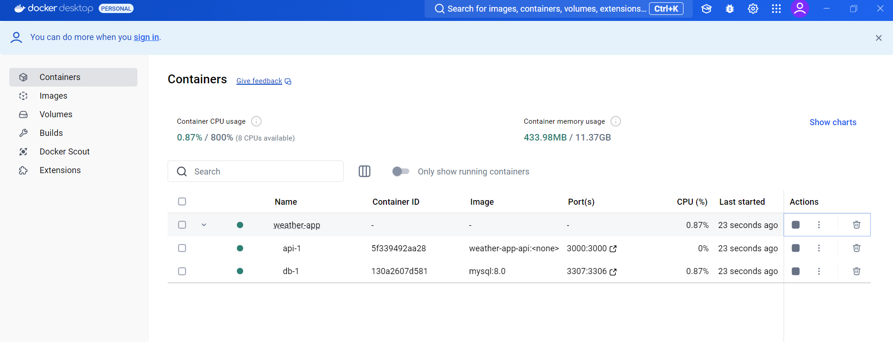
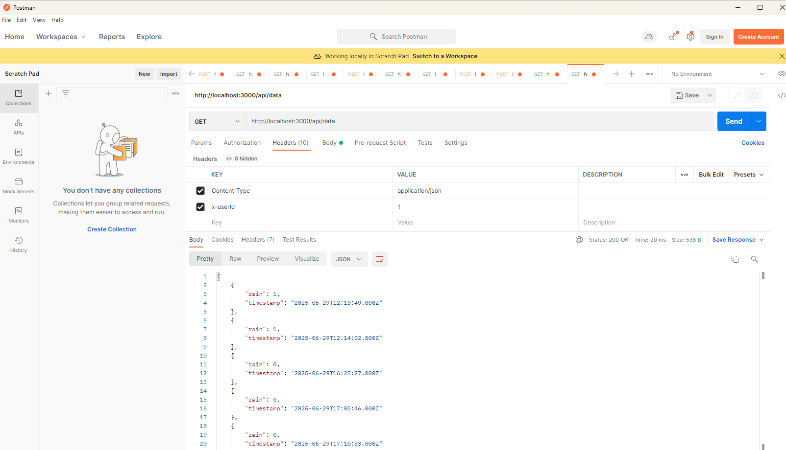
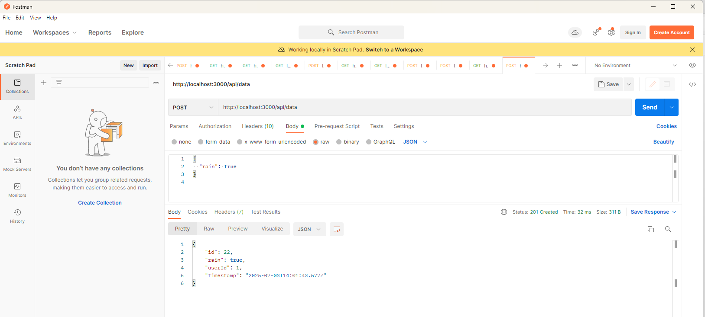
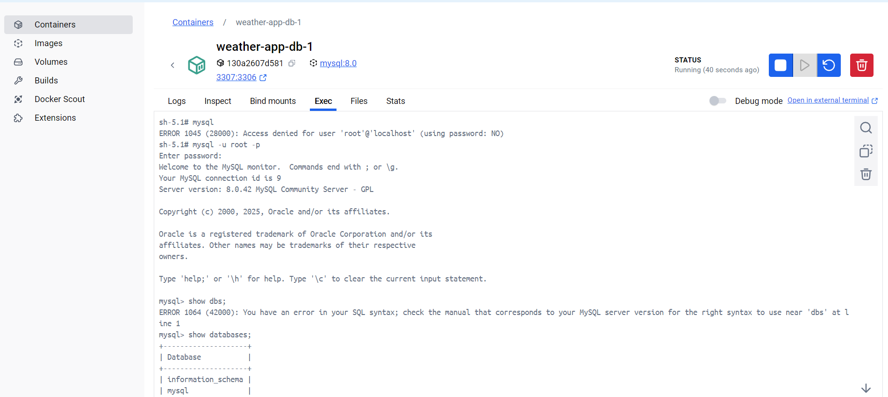
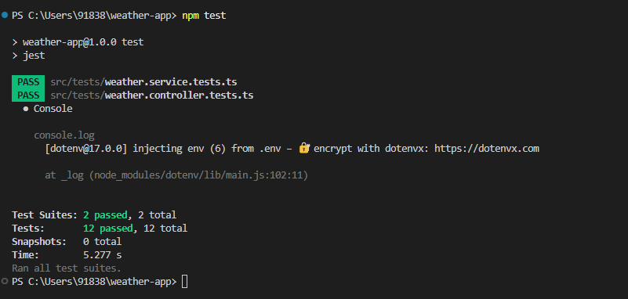

# Weather API

A REST API app to fetch and store weather data.

## Features
- Update and Fetch weather info
- Store weather data by user
- Simple Docker-based setup

## Prerequisites
- Docker Desktop  
- Git 
- VS code
- Postman

## Technologies
 - Typescript
 - Express.js framework
 - Mysql database
 - Docker  


## Setup

```bash
> git clone https://github.com/satishphale/weather-ts-app.git
> cd weather-app
> docker-compose up --build
```
## Demo
### Docker images


### Docker container


### GET call


### POST call


### DB login


### Test results



