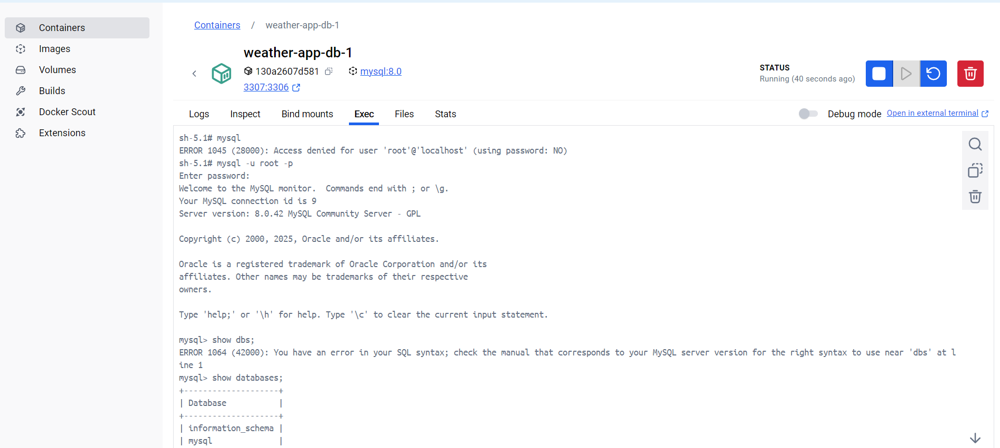

# Weather API

A simple Express + TypeScript REST API to fetch and store weather data.

## Features
- Update and Fetch weather info
- Store weather data by user
- Simple Docker-based setup

## Installation

```bash
git clone https://github.com/satishphale/weather-ts-app.git
cd weather-api
npm install

